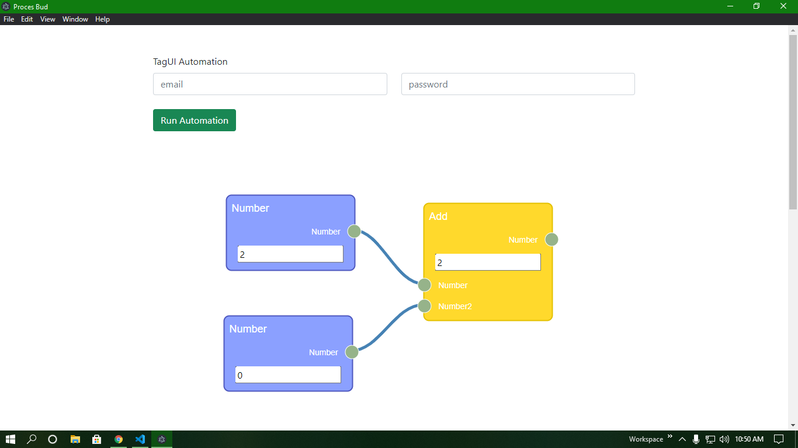
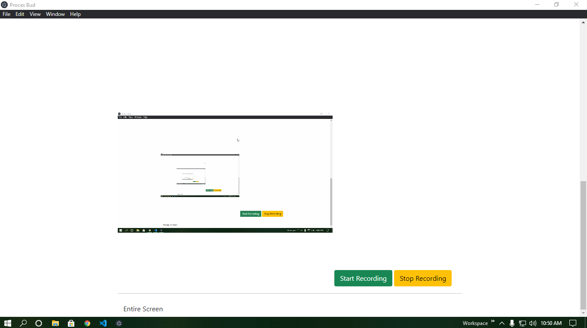

# PB

PB is a proof of concept version

## Installation

Use the package manager [npm](https://www.npmjs.com/get-npm) to install foobar.

```bash
npm install package.json
```

Electron has depreceated `nodeIntegration: true,` in latest version if you run into errors install packages from the package-lock file.

```bash
npm install package-lock.json
```





## License

[MIT](https://choosealicense.com/licenses/mit/)
